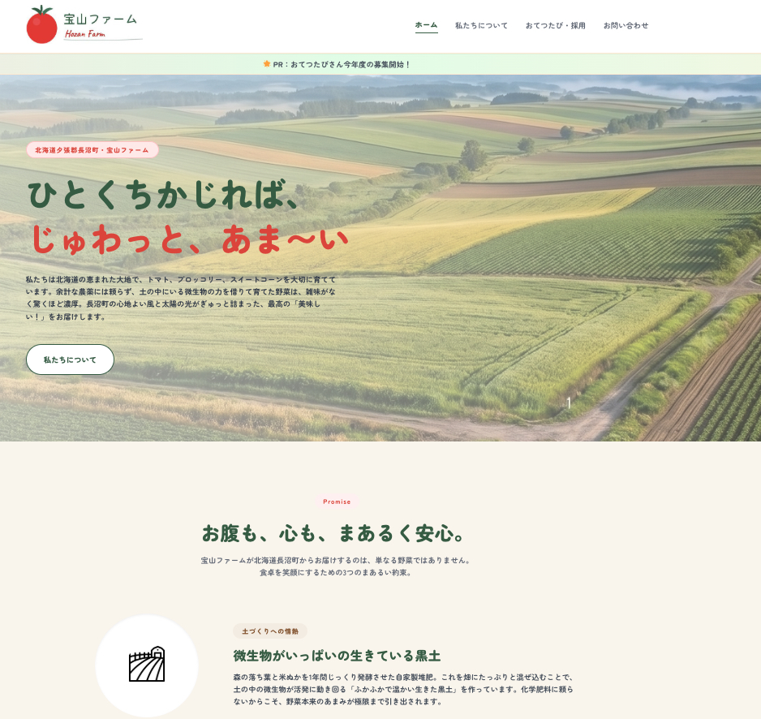

# 宝山農場 - HTMLサイト

北海道長沼町の農家サイトを想定した、Webコーポレートサイト。

## デモ



## 使用技術

- HTML / CSS / JavaScript
- Cloudflare Pages（デプロイ）

## 制作のポイント

- 北海道らしい大地のブランディングで世界観を統一
- レスポンシブ対応
- WordPress版も別途制作（PHP / ACF / Contact Form 7）

## ディレクトリ構成

```
farmer-master-theme/
├── style.css
├── index.html
├── about.html
├── recruit.html
├── single.html
├── page-recruit.html
├── main.js
└── images/
```
